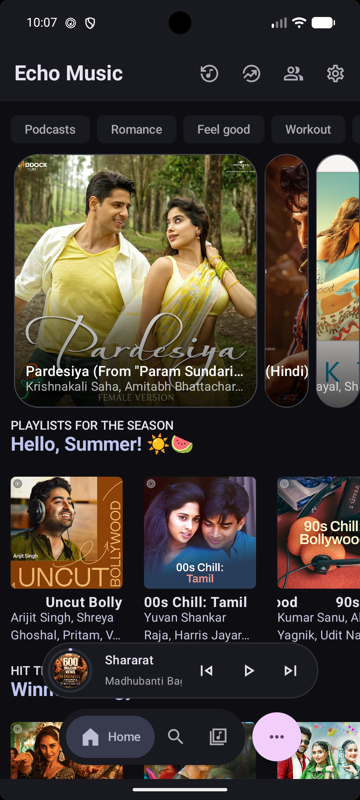
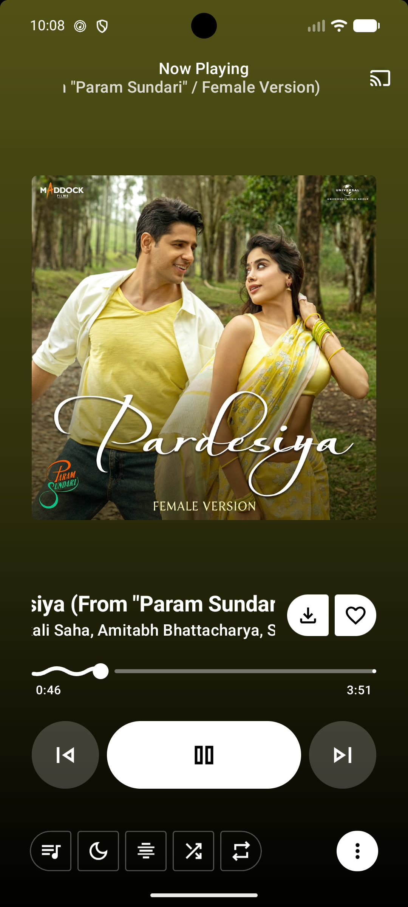
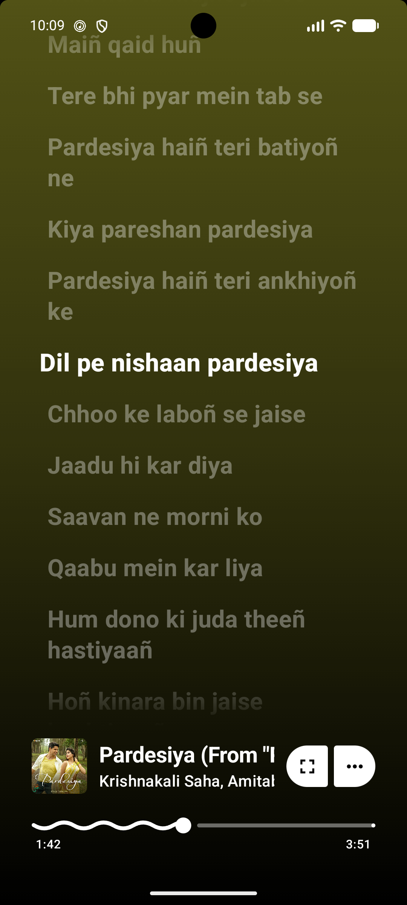
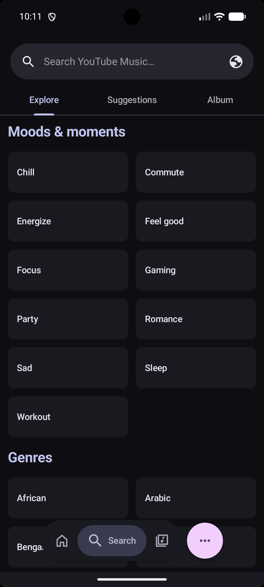
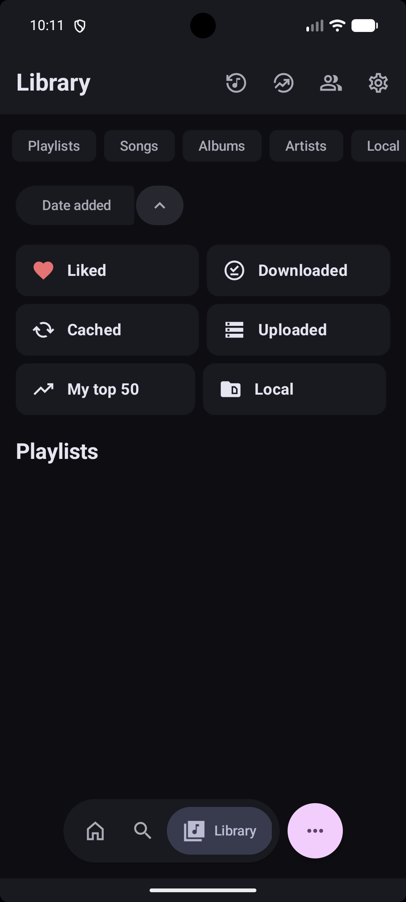
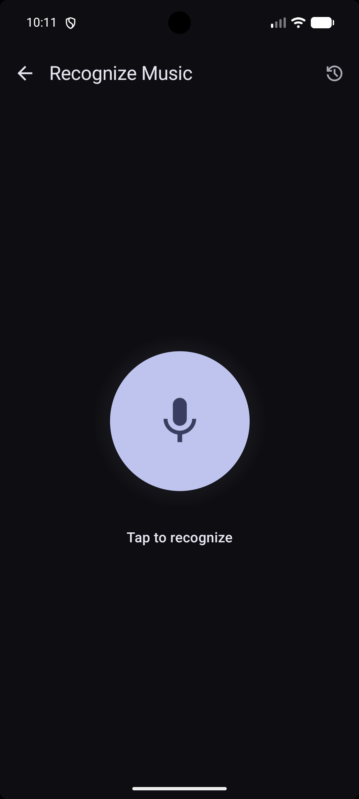

  

  <h1>Echo Music</h1>

  
<strong>A modern Android music app with ad-free streaming, synced lyrics, offline playback, and an intuitive user experience.

   

## Overview

Echo Music delivers a seamless, premium listening experience by leveraging YouTube Music's vast library — without the ads. It adds powerful extras including offline downloads, real-time synchronized lyrics, and environment-aware music recognition.

---

## Screenshots

  <table style="margin: 0 auto; border-collapse: collapse;">
    <tr>
      <td align="center" style="padding: 10px; border: none;">
        <strong>Home Screen</strong>  
        
      </td>
      <td align="center" style="padding: 10px; border: none;">
        <strong>Music Player</strong>  
        
      </td>
      <td align="center" style="padding: 10px; border: none;">
        <strong>Synchronized Lyrics</strong>  
        
      </td>
    </tr>
    <tr>
      <td align="center" style="padding: 10px; border: none;">
        <strong>Search & Explore</strong>  
        
      </td>
      <td align="center" style="padding: 10px; border: none;">
        <strong>Music Library</strong>  
        
      </td>
      <td align="center" style="padding: 10px; border: none;">
        <strong>Echo Find (Recognition)</strong>  
        
      </td>
    </tr>
  </table>

---

## Features

### What's New
- **Lossless Music Hub** — Stream and contribute 16-bit/24-bit FLAC files directly to the Echo Music ecosystem.
- **Data Saver Mode (Beta)** — Automatically reduces data usage during playback for limited connections.
- **Settings Search Index** — Quickly find and navigate to any settings option instantly.
- **Redesigned UI** — Cleaner, faster, and more intuitive interface from the ground up.
- **Import from Spotify** — Bring your playlists and tracks over with ease.
- **Listen Together** — Sync music in real time, similar to Spotify Jam.
- **Podcast Support** — Listen to podcasts alongside your music library.
- **Local Media Support** — Play music files stored directly on your device.
- **Dynamic Island Support** — Enhanced playback notifications on supported Android devices.

### Streaming & Playback
- **Ad-Free** — Stream without any interruptions.
- **Lossless Audio** — Support for 16-bit and 24-bit high fidelity FLAC audio.
- **Data Saver Mode** — Reduce data consumption when streaming on cellular networks.
- **Seamless Playback** — Switch effortlessly between audio-only and video modes.
- **Background Playback** — Listen while using other apps or with the screen off.
- **Offline Mode** — Download tracks, albums, and playlists via a dedicated download manager.
- **Crossfade** — Smooth transitions between tracks.
- **Canvas Animations** — Visual animations while playing music.

### Discovery & Echo Find
- **Echo Find** — Identify songs playing around you using advanced audio recognition.
- **Echo Brain** — An intelligent, on-device engine that analyzes your listening momentum and auto-injects perfectly aligned tracks into your queue. Read more in the [Echo Brain Documentation](ECHO_BRAIN_DOCS.md).
- **Smart Recommendations** — Personalized suggestions based on your listening history.
- **Comprehensive Browsing** — Explore Charts, Podcasts, Moods, and Genres.

### Lyrics
- **Multiple Lyric Animations** — Choose from various lyric display styles.
- **Word-by-Word Lyrics** — Precise per-word synchronization.
- **Lyrics+** — New lyrics provider for improved accuracy and coverage.
- **AI Translation** — Built-in Google Translate integration for lyrics in any language.

### Integrations
- **Music Sharing via Odesli** — Share songs as Song.link for cross-platform listening.
- **Set as Ringtone** — Directly set any song as your device ringtone.

### Smart Playback
- **Pause on Mute** — Auto-pause when your device is muted.
- **Resume on Bluetooth** — Playback resumes when headphones or earbuds reconnect.

### Customization
- **UI Density Scale** — Adjust interface spacing to your preference.
- **High Refresh Rate Support** — Smoother UI and animations on supported displays.
- **Hide Player Thumbnail** — Keep the player minimal without album art.
- **Crop Album Art** — Adjust album art display to fit your style.
- **Hide Video Songs** — Filter out video content from your feed.
- **Hide YouTube Shorts** — Keep Shorts out of your music browsing.

---

## Translations

<h3>We use Weblate to translate Echo Music. <a href="https://hosted.weblate.org/projects/echo-music/">Help us bring Echo Music to more people!</a></h3>

---

## Special Thanks

Echo Music stands on the shoulders of several excellent open-source projects. Sincere thanks to:

| Project | Description |
| :--- | :--- |
| [Metrolist](https://github.com/MetrolistGroup/Metrolist) & [Vivi Music](https://github.com/vivizzz007/vivi-music) | Foundational inspiration and architecture reference |
| [ArchiveTune](https://github.com/koiverse/ArchiveTune) | Material You UI inspiration |
| [Better Lyrics](https://better-lyrics.boidu.dev/) | Lyrics enhancement and synchronization |
| [SimpMusic](https://github.com/maxrave-dev/SimpMusic) | Lyrics implementation reference |
| [Music Recognizer](https://github.com/aleksey-saenko/MusicRecognizer) | Audio recognition (Echo Find) |
| [Flow](https://github.com/a-edev/Flow) | AI queue generation engine (Echo Brain) |
| [zemer-cipher](hhttps://github.com/ZemerTeam/zemer-cipher) | YouTube cipher deobfuscation and PoToken generation |

---

  Licensed under <a href="LICENSE">GPL-3.0</a>

# echo-music-community
